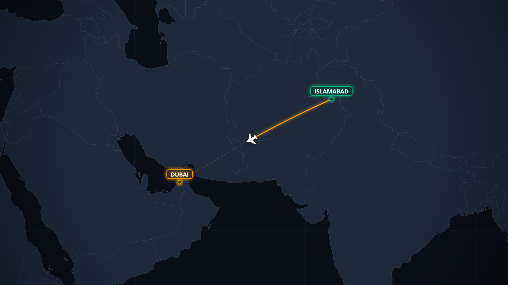
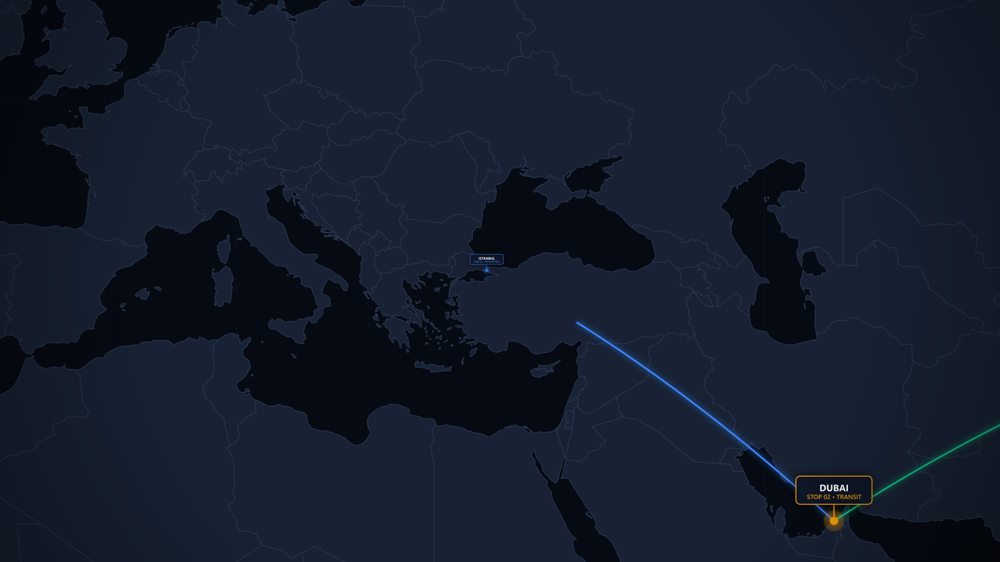
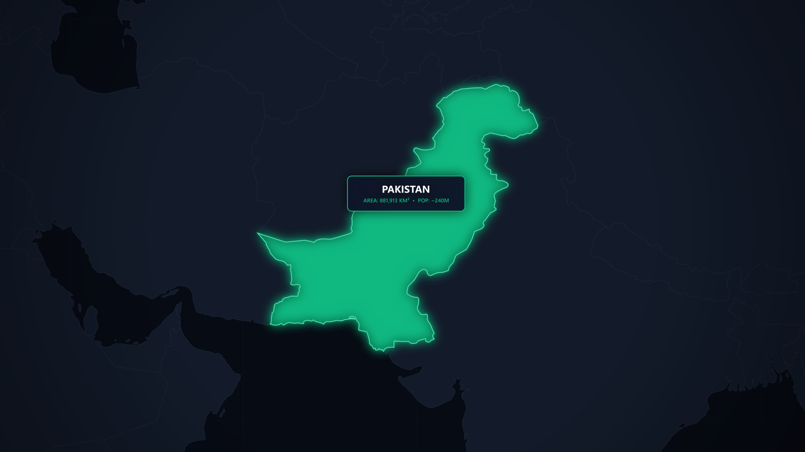
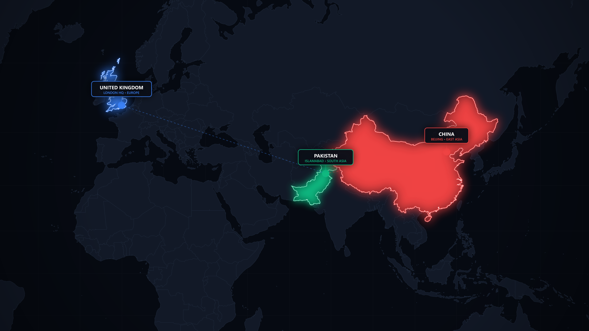
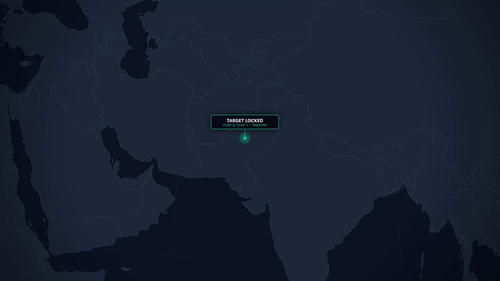
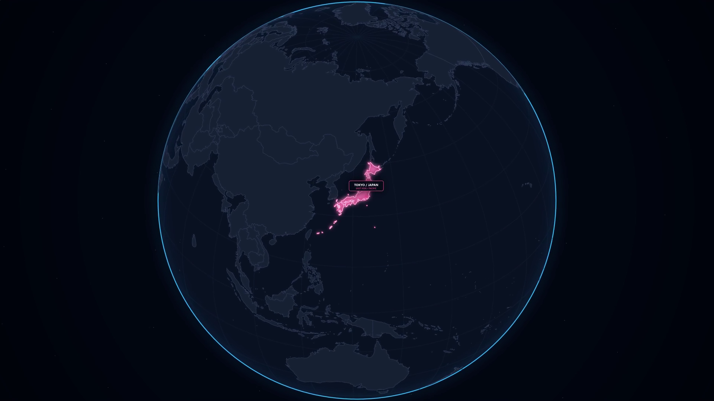
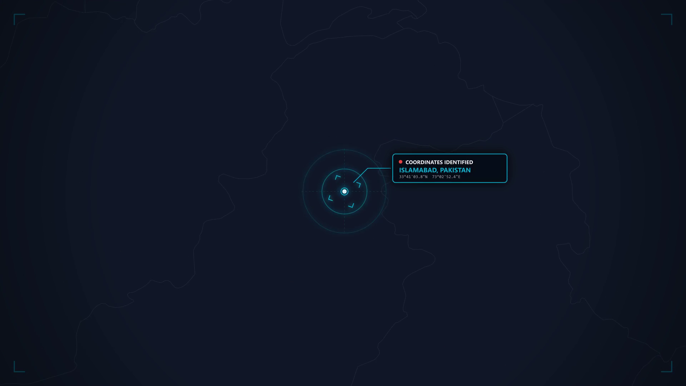
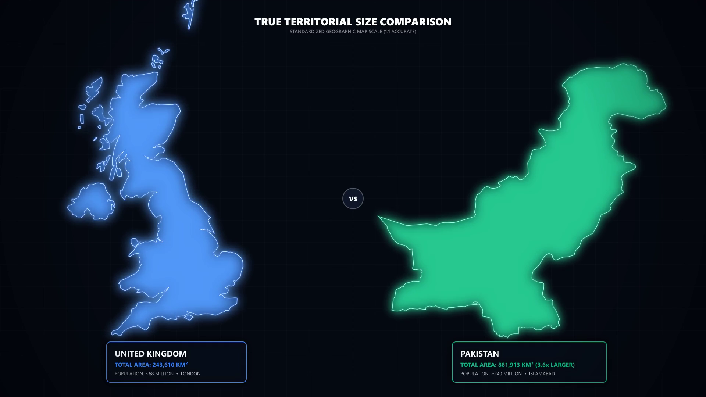

# 🌍 Cinemacart - Procedural Cinematic Map & Motion Graphics Video Engine

A high-performance, offline, procedural map animation and documentary motion graphics video engine inspired by **Vox**, **Johnny Harris**, and **Casian** style cartography.

Built with **Node.js, Canvas, D3-Geo, and FFmpeg** with a direct zero-disk memory pipe architecture.

---

## 🚀 Key Features

- **100% Offline & Free:** Bundled with Natural Earth 1:50m TopoJSON datasets (`world-atlas`). No map APIs, telemetry, or API tokens needed.
- **Zero-Disk RAM Pipe Rendering:** Canvas frames stream directly into FFmpeg stdin (`image2pipe`), eliminating disk write bottlenecks.
- **Cinematic Visual Styles:**
  - Dark Midnight Ocean (`#060a12`) + Charcoal Landmass (`#1e293b`).
  - Pulsing radar beacons, glowing neon borders, glassmorphic HUD tags, and dynamic vignette shaders.
  - Coordinate axis grids, great-circle flight arcs, and smooth cubic bezier easing.

---

## 🎬 Showcase & Video Gallery

All animations below are procedurally generated in **1080p Full HD (1920x1080) at 30 fps**. Click the video links or play them directly.

---

### 1. Flight / Transit Route Arc
Great-circle curved trajectory (Islamabad ➔ Dubai) with dynamic airplane heading rotation and glowing waypoint pins.



* 📹 **Full Video:** [Watch MP4 Video (1080p)](videos/islamabad_to_dubai_route.mp4)
* 💻 **Run:** `node render_frames.js`

---

### 2. Multi-Stop Storyline Route
Sequential multi-checkpoint route across South Asia and the Middle East (Islamabad ➔ Dubai ➔ Istanbul) with staggered frosted glass info cards.



* 📹 **Full Video:** [Watch MP4 Video (1080p)](videos/multistop_pins_route.mp4)
* 💻 **Run:** `node render_multistop.js`

---

### 3. Country / Territory Spotlight
Geopolitical boundary isolation with multi-pass neon emerald glow, dark mask shading, and frosted glass statistics card.



* 📹 **Full Video:** [Watch MP4 Video (1080p)](videos/pakistan_territory_highlight.mp4)
* 💻 **Run:** `node render_highlight.js`

---

### 4. Multi-Country Comparison (Eurasia Corridor)
Staggered boundary illumination across Eurasia (London ➔ Pakistan ➔ China) with animated trade ray connectors and synchronized HUD badges.



* 📹 **Full Video:** [Watch MP4 Video (1080p)](videos/three_countries_highlight.mp4)
* 💻 **Run:** `node render_3countries.js`

---

### 5. 3D Rotating Globe Spin & Land
3D Orthographic spherical Earth rotating in deep cosmic space with atmospheric edge glow, starry background, and target reticle lock.



* 📹 **Full Video:** [Watch MP4 Video (1080p)](videos/globe_spin_and_land.mp4)
* 💻 **Run:** `node render_globe_fast.js`

---

### 6. Multi-Stop 3D Globe Tour
Continuous planetary spin across multiple continents, transitioning smoothly from East Asia (Tokyo) to South Asia (India) to the Middle East (Iraq & Saudi Arabia).



* 📹 **Full Video:** [Watch MP4 Video (1080p)](videos/globe_4countries_tour.mp4)
* 💻 **Run:** `node render_globe_4countries.js`

---

### 7. Locator Beacon / Tactical Focus Pulse
Rapid camera dive from high altitude with 3 concentric expanding radar sonar ripples and crosshair reticle target lock.



* 📹 **Full Video:** [Watch MP4 Video (1080p)](videos/locator_beacon_focus.mp4)
* 💻 **Run:** `node render_beacon_focus.js`

---

### 8. Side-by-Side Territorial Comparison (1:1 True Scale)
Direct physical geographic size comparison (e.g. UK vs Pakistan 3.6x area) eliminating Mercator projection distortions with neon split divider.



* 📹 **Full Video:** [Watch MP4 Video (1080p)](videos/territorial_comparison.mp4)
* 💻 **Run:** `node render_split_comparison.js`

---

## ⚡ Performance Benchmark

Measured on standard consumer hardware:

| Map Type | 1 Frame Render | 100 Frames Render | FPS Speed |
| :--- | :--- | :--- | :--- |
| **Flat Mercator** *(Route, Highlight, Split)* | **`184 ms`** (~0.18s) | **`16.26 s`** | **~6.1 fps** |
| **3D Spherical Globe** *(Orthographic)* | **`187 ms`** (~0.18s) | **`17.31 s`** | **~5.8 fps** |

Encoding directly into MP4 via FFmpeg takes an additional **~3-4 seconds**.

---

## 📦 Installation & Usage

```bash
# Clone the repository
git clone https://github.com/staryslayer3-png/cinemacart-map-animator.git
cd cinemacart-map-animator

# Install dependencies
npm install

# Run any template
node render_frames.js
```

---

## 📄 License
MIT License. Free to use for personal and commercial projects.